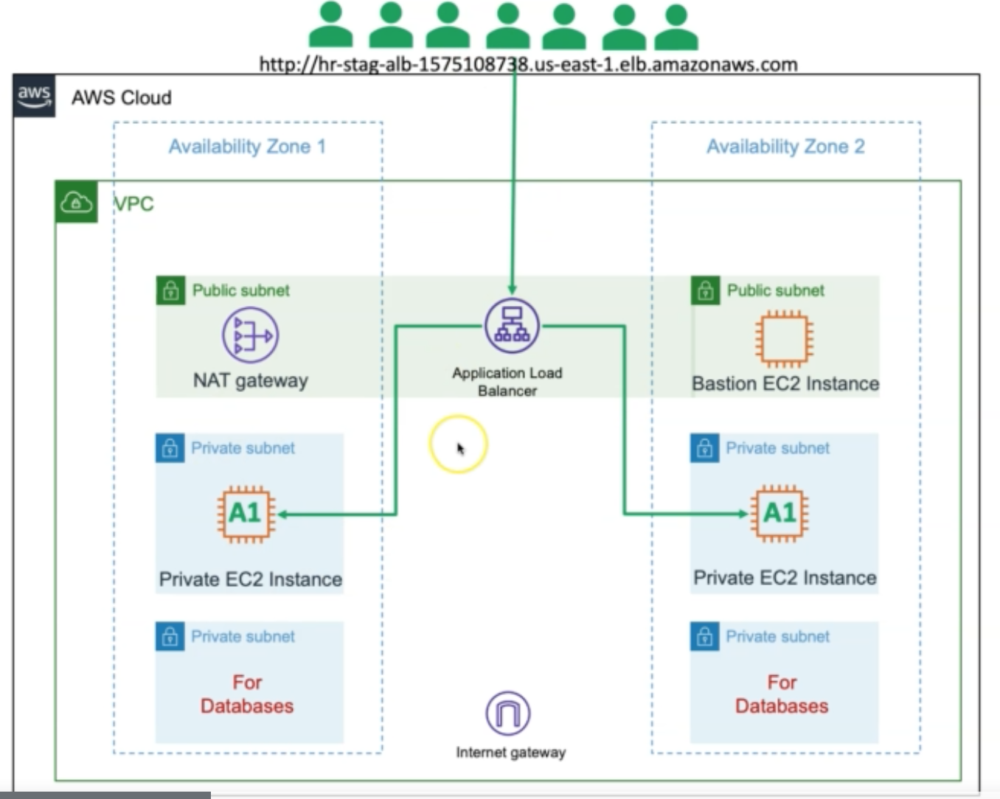

## Installation

1. You should have AWS Account.

   - [Create an AWS Account](https://portal.aws.amazon.com/billing/signup?nc2=h_ct&src=header_signup&redirect_url=https%3A%2F%2Faws.amazon.com%2Fregistration-confirmation#/start)

2. Generate Security Credentials using AWS Management Console

   - Go to Services -> IAM -> Users -> "Your-Admin-User" -> Security Credentials -> Create Access Key

3. Configure AWS credentials using SSH Terminal on your local desktop

   

4. ```
   # Terraform Init
   terraform init 
   
   # Terraform Validate
   terraform validate
   
   # Terraform Plan
   terraform plan -var-file="secrets.tfvars"
   
   # Terraform Apply
   terraform apply -var-file="secrets.tfvars
   ```

You will see as output the url to access the load balancer from your browser. 

```
# Destroy Resources
terraform destroy -auto-approve

# Delete Files
rm -rf .terraform*
rm -rf terraform.tfstate
```